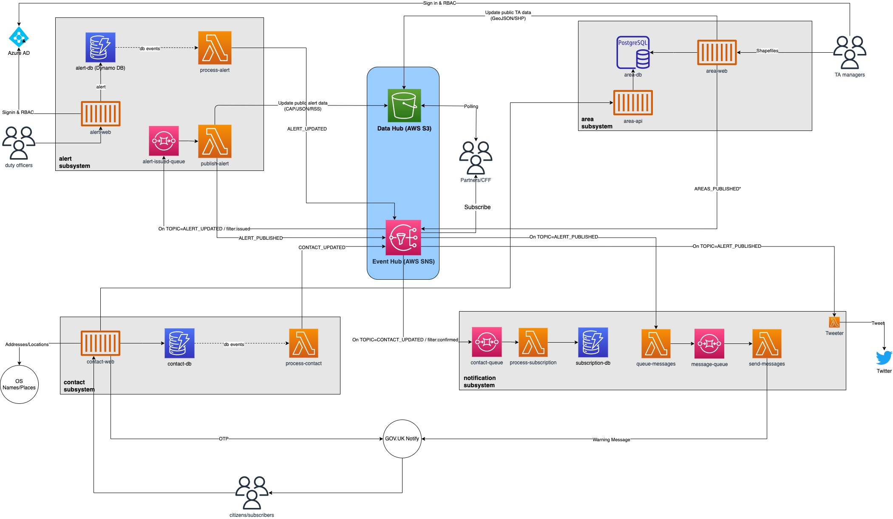

# XWS Development

XWS system overview documentation for developers

[Link to diagram](https://app.diagrams.net/#G1S5-dDxH7QjJ753tOx-tl4uQMDv3Vqmlj)

XWS is comprised of 4 main sub-systems, decoupled with a central data and event hub.

## Alert subsystem

The [Alert subsystem](/subsystems/alert/readme.md) is set of components that together allow for the creating and publishing alerts by internal EA / Defra Staff.

Components

- [alert-web](https://github.com/DEFRA/flood-xws-alert-web) An internal web interface based on the GDS Design System

## Notification subsystem

Components to let people and systems know there is alert. Informing mechanisms let people obtain information when they feel like it.

A robust set of components that broadcast the Alert through various channels with fallbacks where neccessary.

Responsible for:

- Disseminating the Alert
- Recording delivery receipts

Solutions

- Notify/SES/SNS/SQS
- Twilio (voice)
- Twitter, Facebook

## Area subsystem

An area is a place where Alerts can be issued. An area describes a geographical location to which the alert info applies.

The [Area subsystem](/subsystems/area/readme.md) is a set of components that together allow for the management and publication of the set of areas.

Responsible for:

- Managing target data including geospatial areas
- Publishing versioned datasets

Components

- [area-api](https://xws-area-api-sandbox.london.cloudapps.digital/documentation) An internal Web API providing geospatial endpoints.

## Contact subsystem

A contact is a person who is registered to receive alerts. The [Contact subsystem](/subsystems/contact/readme.md) is the set of components that facilitate contact registration and maintenance. 

Components

- [contact-web](/subsystems/contact/web/readme.md) An external public-facing web interface based on the GDS Design System

### Terminology
- Alert - An alert is the core element of the systems. Its purpose, its source and its status, as well as a unique identifier for the current alert and links to any other, related alerts. An may be used alone for acknowledgements, cancellations or other system functions. An alert is something that can be issued.

- Area - An area is somewhere an alert can be issued for

- Message - A message is an alert as it it transmitted to a subscriber (e.g. SMS, System Messages)

- Warning - A warning is a verb and is used to give notice, advice, or intimation to (a person, group, etc.) of danger or harm

# Resources

See https://github.com/DEFRA/flood-xws-resources

# Get flood warnings

https://xws-contact-web-sandbox.london.cloudapps.digital

For the public site, you should be able to follow the initial journey, register multiple addresses/areas, and add email/mobile and landline contact information. You should also be able to sign in again (using the link on the home page)

Currently, the one-time passwords are configured to be sent using GOV.UK Notify.

(Landline contact registration should also work but I haven't been able to test as I don't have a landline. I know we said we'll probably remove it for private beta though.)

See https://github.com/DEFRA/flood-xws-contact-web

# Manage flood warnings

https://xws-alert-web-sandbox.london.cloudapps.digital

Currently you can see the national overview and browse owners/areas. You can also issue alerts and warnings using a very basic form that contains just the message headline, body and some CAP details. If it's a flood warning area, you also need to specify the type (flood warning or severe flood warning). Once you issue the alert/warning - it's live, there's no approval process.

See https://github.com/DEFRA/flood-xws-alert-web

# Alert hosting (Data hub)

Live flood alerts and warnings are hosted at these URLs:

 
JSON Feed: https://xws-alert-sandbox-files.s3.eu-west-2.amazonaws.com/alerts/alerts.json
CAP XML RSS Feed: https://xws-alert-sandbox-files.s3.eu-west-2.amazonaws.com/alerts/alerts.rss
CAP XML ATOM Feed: https://xws-alert-sandbox-files.s3.eu-west-2.amazonaws.com/alerts/alerts.rss

These public URLs would be used by partners/downstream systems in a "polling" fashion. They could check every few seconds to see if they have been updated. This is common in alerting/feed systems. These URLs are backed by Amazon S3 which is ideal for this use case. It provides high SLAs and guarantees of durability (11 x "9's").

(For production, we would configure a "nice" short domain. Something like https://defra.floods.com/alerts/alerts.rss or https://xws.com/alerts/alerts.rss)
